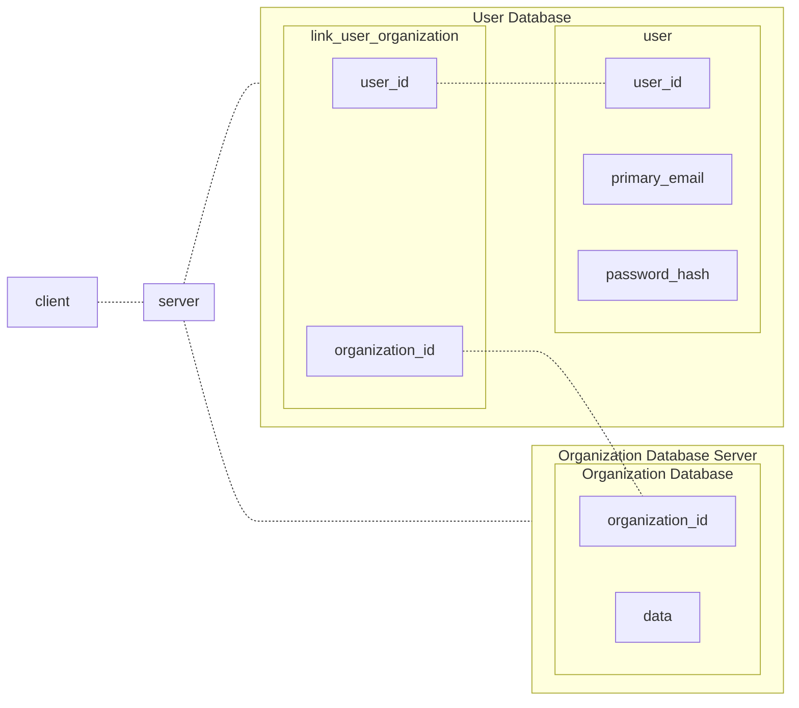

# Data model

```mermaid
graph LR
    subgraph user_database[User Database]
        subgraph user
            user_id
            primary_email
            password_hash
        end
        subgraph link_user_organization
            link_user_organization.user_id[user_id]
            link_user_organization.organization_id[organization_id]
        end
    end

    subgraph organization_database_server[Organization Database Server]
        subgraph organization_database[Organization Database]
            organization_id
            data
        end
    end

    subgraph server
    end

link_user_organization.user_id -.- user_id
link_user_organization.organization_id -.- organization_id

server -.- organization_database_server
server -.- user_database

client -.- server
```
